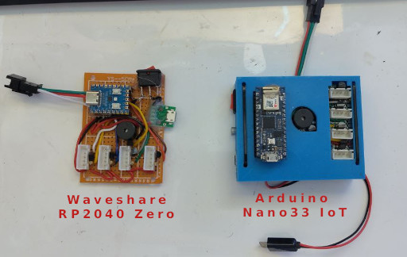

# LED Race

[TinyGo](https://tinygo.org/) implementation of the [Open LED Race project](https://openledrace.net/) _"Minimalist race game with an LED strip"_ by [openledrace](https://x.com/openledrace).


In the game, we simulate a ractrack with an LED strip, and up to 4 different players are represented by colored individual LEDs (red, green, yellow & blue). The players advance through the LED strip by button presses, the faster you click the button, the faster it will move.

There are _ramps_ & _slopes_ that will make the player go faster or slower, and require extra button presses to overcome them.

By default, you could see the ramps & slopes if during boot, the red player button is pressed (and not released for a few seconds).


[](http://www.youtube.com/watch?v=bXJm5zj4HV4)

_(Click on the image above for video on YouTube)_


## Flashing



*KITS*


If you have the Arduino Nano33 IoT KIT:
```ssh
tinygo flash -target arduino-nano33 --monitor .
```

If you have the Waveshare RP2040 Zero KIT:
```ssh
tinygo flash -target waveshare-rp2040-zero --monitor .
```

## Ideas
- One cool thing to do, is change the player's button by any other sensor or actuator, some community versions require you to step on a metalic platform (like those dance games) or opening and closing your hand using one of those hand grips from the gym. Your imaginaton is the limit (but the hardware at the hack session is limited :( )
- Another idea for the hack session could be to add some sort of telemetry.
- Add _power ups_, like speed boost, enemy freeze, oil puddle,...  
- Different track topology: like pit stop or bifurcations.
- New melodies or visual effects.

## License

The MIT License (MIT)

Copyright 2019 Daniel Esteban - conejo@conejo.me

Permission is hereby granted, free of charge, to any person obtaining a copy of this software and associated documentation files (the "Software"), to deal in the Software without restriction, including without limitation the rights to use, copy, modify, merge, publish, distribute, sublicense, and/or sell copies of the Software, and to permit persons to whom the Software is furnished to do so, subject to the following conditions:

The above copyright notice and this permission notice shall be included in all copies or substantial portions of the Software.

THE SOFTWARE IS PROVIDED "AS IS", WITHOUT WARRANTY OF ANY KIND, EXPRESS OR IMPLIED, INCLUDING BUT NOT LIMITED TO THE WARRANTIES OF MERCHANTABILITY, FITNESS FOR A PARTICULAR PURPOSE AND NONINFRINGEMENT. IN NO EVENT SHALL THE AUTHORS OR COPYRIGHT HOLDERS BE LIABLE FOR ANY CLAIM, DAMAGES OR OTHER LIABILITY, WHETHER IN AN ACTION OF CONTRACT, TORT OR OTHERWISE, ARISING FROM, OUT OF OR IN CONNECTION WITH THE SOFTWARE OR THE USE OR OTHER DEALINGS IN THE SOFTWARE.


